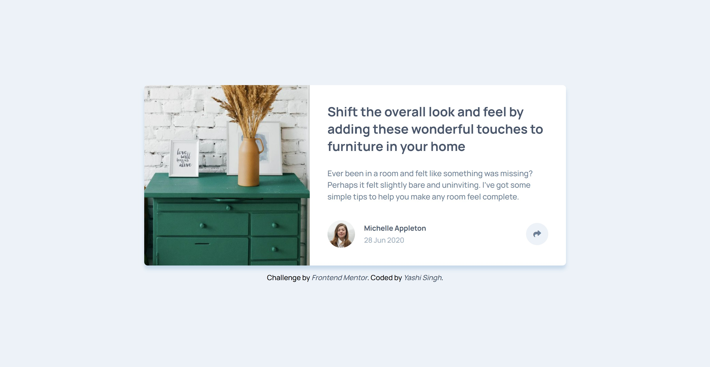
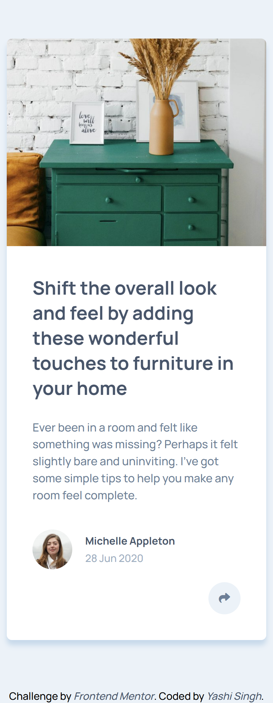

# Frontend Mentor - Article Preview Component Solution

This is a solution to the [Article Preview Component challenge on Frontend Mentor](https://www.frontendmentor.io/challenges/article-preview-component-dYBN_pYFT). Frontend Mentor challenges help you improve your coding skills by building realistic projects.

## Table of contents

- [Overview](#overview)
  - [The challenge](#the-challenge)
  - [Screenshot](#screenshot)
  - [Links](#links)
- [My process](#my-process)
  - [Built with](#built-with)
  - [What I learned](#what-i-learned)
  - [Continued development](#continued-development)
  - [Useful resources](#useful-resources)
- [Installation and Running SCSS](#installation-and-running-scss)
- [Author](#author)
- [Acknowledgments](#acknowledgments)

## Overview

### The challenge

Users should be able to:

- View the optimal layout for the component depending on their device's screen size
- See the social media share links when they click the share icon

### Screenshot

**Desktop Design**



**Mobile Design**



### Links

- Solution URL: [Solution](https://www.frontendmentor.io/solutions/article-preview-component-TVtRg-zcxi)
- Live Site URL: [Live Site](https://yashi-singh-9.github.io/Article-Preview-Component/)

## My process

### Built with

- Semantic HTML5 markup
- CSS custom properties
- Flexbox
- CSS Grid
- Mobile-first workflow
- SCSS for styles
- JavaScript for functionality (toggle share links)

### What I learned

Working on this challenge helped me solidify my understanding of responsive web design, especially in terms of ensuring that the layout adapts well to different screen sizes. I learned how to:

- Implement mobile-first CSS using SCSS.
- Toggle visibility of elements (e.g., social media share links) dynamically using JavaScript.
- Use accessibility attributes such as `aria-expanded` for a better user experience with screen readers.
- Structure a simple but effective article preview component with semantic HTML.

#### Example Code:

Here’s an example of the JavaScript I’m proud of, which controls the share button toggle:

```javascript
// Select the share button and the share links container
const shareButton = document.getElementById("share-button");
const shareLinks = document.getElementById("share-links");

// Add event listener for the share button click
shareButton.addEventListener("click", () => {
  // Toggle the 'hidden' class on the share links
  shareLinks.classList.toggle("hidden");

  // Update the 'aria-expanded' attribute for accessibility
  const isExpanded = shareButton.getAttribute("aria-expanded") === "true";
  shareButton.setAttribute("aria-expanded", !isExpanded);
});
```

### Continued development

In the future, I would like to refine my JavaScript by adding additional features like animation for the share buttons or improving the accessibility of the layout. I am also planning to work on improving the SCSS structure and explore more advanced CSS techniques such as CSS animations and transitions.

### Useful resources

- [Frontend Mentor Articles](https://www.frontendmentor.io/resources) – Great for finding challenges that help you improve your coding skills.
- [SCSS Documentation](https://sass-lang.com/documentation) – For understanding the full potential of SCSS and its mixins/functions.
- [MDN Web Docs - Accessibility](https://developer.mozilla.org/en-US/docs/Web/Accessibility) – To better understand how to make web content more accessible.

## Installation and Running SCSS

To install and run the SCSS files on your local machine, follow these steps:

1. **Install Node.js**  
   First, make sure you have **Node.js** installed. If not, you can download it from the [official website](https://nodejs.org/).

2. **Clone the Repository**  
   Clone this repository to your local machine by running:

   ```bash
   git clone https://github.com/Yashi-Singh-9/Article-Preview-Component.git
   cd article-preview-component
   ```

3. **Install Dependencies**  
   Run the following command to install **npm** dependencies, which include `sass` for SCSS compilation:

   ```bash
   npm install
   ```

4. **Compile SCSS**  
   After installing the dependencies, you can run the SCSS compiler. This will compile the SCSS files into a CSS file automatically. Use the following command:

   ```bash
   npx sass --watch scss:css
   ```

   This will watch for changes in your `scss` directory and compile them to the `css` directory. You can now link the compiled CSS file to your HTML.

5. **Run the Application**  
   Once everything is set up, open the `index.html` file in your preferred browser to view the project.

## Author

- Frontend Mentor - [Yashi-Singh-9](https://www.frontendmentor.io/profile/Yashi-Singh-9)
- LinkedIn - [Yashi Singh](https://www.linkedin.com/in/yashi-singh-b4143a246)

## Acknowledgments

- Thanks to the [Frontend Mentor community](https://www.frontendmentor.io/community) for feedback and suggestions throughout the project.
- Special thanks to the resources available on MDN for their excellent tutorials on accessibility.

---

### Notes:
- Be sure to replace the placeholder text (e.g., `Add solution URL here`, `Add your name here`) with your actual information.
- Add your **screenshot** in the appropriate folder and update the path.
